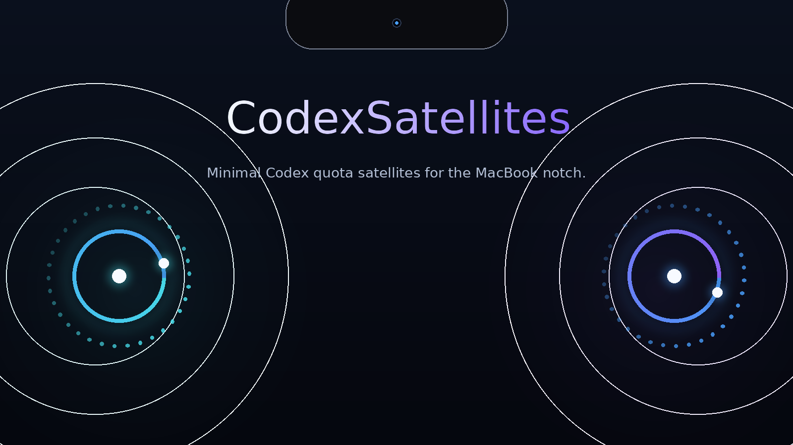

# CodexSatellites

Minimal Codex quota satellites for the MacBook notch.



## What it does

CodexSatellites is a native macOS ambient HUD for the built-in display of a notched MacBook. It keeps the hardware notch untouched and shows two small quota orbs beside it:

CodexSatellites is an independent community utility and is not affiliated with or endorsed by OpenAI.

- Left satellite → Codex 5h remaining
- Right satellite → Codex weekly remaining

## Interaction

- Hover → both satellites expand and show remaining percentages.
- Click either satellite → a compact Settings Bar appears.
- Settings Bar → `Launch at Login` and `Quit` only.

## Requirements

- macOS 15+
- MacBook with a hardware notch
- Existing local Codex CLI authentication

## How it works

The app reads the existing local Codex authentication state and requests the current quota windows. It classifies the 5-hour and weekly windows by their server-provided duration, then positions two non-activating panels using the display's camera-housing geometry.

## Privacy & authentication

CodexSatellites does not perform login or OAuth. It reads the existing local Codex authentication state. It does not refresh tokens or write Codex auth files.

## Development

Build and run the app with:

```bash
./script/build_and_run.sh
```

Use `./script/build_and_run.sh --verify` to build, launch, and verify the process.

## Documentation

- [Product & UX SPEC](01_PRODUCT_UX_SPEC.md)
- [Technical Architecture](02_TECHNICAL_ARCHITECTURE.md)
- [Test & Acceptance](04_TEST_ACCEPTANCE.md)
- [Research & Reference Notes](06_RESEARCH_REFERENCES.md)

## Current status

v0.1.0 release engineering

## Release engineering

The outside-Mac-App-Store release workflow uses Developer ID signing, Hardened Runtime, notarization, stapling, and a DMG:

```bash
./script/release.sh preflight
./script/release.sh preview
./script/release.sh all
```

The release script reads signing and notarization identity from the local environment and Keychain. It never stores credentials in the repository. Generated artifacts and release evidence live under the ignored `dist/` directory.

## Known limitations

- Codex usage currently depends on an undocumented ChatGPT usage endpoint.
- Full-screen Space behavior is a v0.1 compatibility limitation unless explicitly validated.
- The app assumes an existing local Codex login and does not manage authentication.
